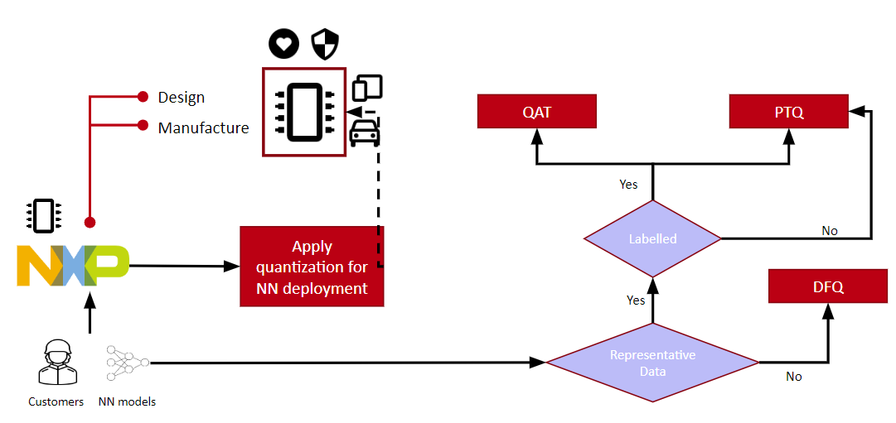
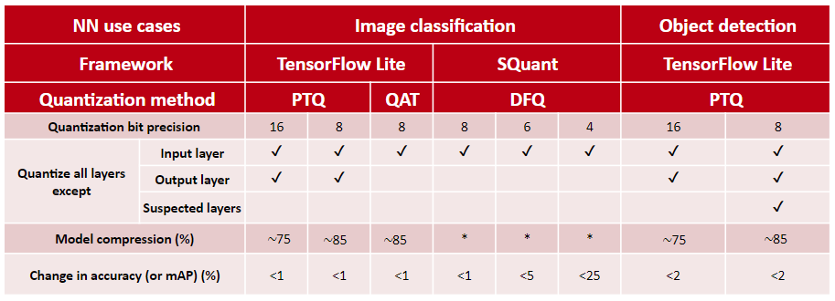

# Evaluation of Quantization Methods for Neural Networks

## Overview

Neural networks are widely used in machine learning applications. However, their deployment in resource-constrained devices is challenging due to high computational and memory requirements. Quantization is a popular technique that reduces model size and computation cost by lowering numerical precision, often at the expense of accuracy.

This repository presents an **evaluation and characterization of state-of-the-art neural network quantization methods** applied to **image classification** and **object detection** tasks. The work focuses on understanding the trade-offs between model compression and performance, particularly in the context of **edge devices and tinyML applications**.

  

  <em>Decision flow for selecting quantization strategies (QAT, PTQ, DFQ) for neural network deployment based on data availability in edge-device pipelines.</em>

## Research Objectives

The key objectives of this work are:

- To evaluate state-of-the-art neural network quantization techniques on different SOTA model architectures.
- To investigate the applicability of these quantization techniques for production use cases such as image classification and object detection.
- To analyze model size reduction, inference efficiency, and performance degradation due to quantization.

## Quantization Frameworks Studied

The following frameworks and techniques are evaluated:

- **TensorFlow Lite**
  - Post Training Quantization (PTQ)
  - Quantization Aware Training (QAT)
  - 16-bit and 8-bit precision

- **QKeras**
  - Sub-8-bit quantization
  - Quantized bits and quantized power-of-two (po2) mappings

- **SQuant**
  - Data-Free Quantization (DFQ)
  - Cross-layer equalization and bias correction
  - Hessian-based rounding (SQuant-hessian)

## Model Architectures

### Image Classification
- MobileNet
- ResNet50
- InceptionV3  

### Object Detection
- EfficientDet-Lite0
- SSD MobileNet
- CenterNet
- RetinaNet 

## Datasets

- CIFAR-10  
- Oxford-IIIT Pet Dataset  
- Pascal VOC  

## Key Results

  

  <em>Result Summary</em>

- TensorFlow Lite quantization to **16-bit and 8-bit precision** achieved approximately **75% and 85% model size reduction**, respectively.
- Image classification models showed **< 1% change in accuracy** for both 16-bit and 8-bit quantization.
- Object detection models showed **< 2% change in mAP** for the same precisions.
- QKeras-based quantization resulted in **significant accuracy degradation (>95%)** for the evaluated models.
- SQuant achieved:
  - **< 1% accuracy drop** at 8-bit
  - **< 5% accuracy drop** at 6-bit
  - **< 25% accuracy drop** at 4-bit
- All image classification models were successfully quantized.
- For object detection, **only SSD MobileNet** was successfully quantized without errors.

## Contribution and Significance

This work bridges the gap between **academic quantization research** and **industrial deployment requirements**, especially for edge and embedded systems. It highlights the maturity of quantization frameworks for image classification while identifying limitations and future needs for object detection models.

## Thesis Document

The complete Master’s thesis associated with this work is publicly available as a PDF.

**Title:** *Evaluation of Quantization Methods for Neural Networks*  
**Author:** Mundichipparakkal, J.  
**Date:** 22 December 2022  
**Type:** Student thesis (Master’s)  

📄 **PDF:** *Thesis PPT.pptx* 
📄 **PDF:** *Evaluation of Quantization Methods for Neural Networks.pdf*  
🔗 **Official repository link:**  
https://research.tue.nl/en/studentTheses/evaluation-of-quantization-methods-for-neural-networks/

This document provides the full theoretical background, experimental setup, quantitative results, and detailed analysis of the quantization methods evaluated in this repository.
